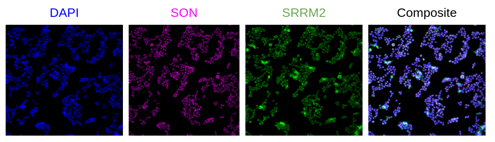

# Nuclear Speckle Image Profiling

In this repository, image analysis and image-based profiling is performed on a nuclear speckle dataset to extract CellProfiler morphology features for predicting nuclear speckle protein markers.

We have 3 channels in this assay:

- **DAPI** - nucleus stain
- **A647** - SON protein marker for nuclear speckles
- **GOLD** - SRRM2 protein marker for nuclear speckles


> This montage shows an example image set from one site after maximum projection of 9 z-slices and illumination correction.

There are 2 cell lines in this project, `786O` which is treated with siRNA and `293T` which is not treated.
Four slides/plates of data have been collected, with 8 wells each.
Of the plates, there are two layouts with two replicates each.

## Environments

There are three conda environments we use in this repository:

1. [`cellprofiler_env.yml`](./cellprofiler_env.yml) is used for running CellProfiler in parallel across plates.
2. [`python_env.yml`](./python_env.yml) is used for notebooks focused on either preprocessing steps or other analysis.
3. [`r_env.yml`](./r_env.yml) is used for visualization of data and generating plots.

These environments can be created using the command:

```bash
# can use either conda or mamba
conda env create -f ...
```
